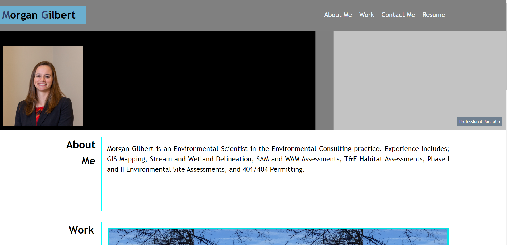

"# Professional-Portfolio-UI" 
# Description:
## Professional Portfolio - UI
 

### Within this website, there are four main areas: Header, Hero, About, Work, and Footer 

### 1st. The Header:
#### Horiseon (Which includes navigation links to the three focuses under Hero and resume link - which is still in progress, so no link yet)
 

### 2nd. Hero:
#### Morgan Gilbert (which includes a recent photo of me and "Professional Portfolio")
#### Simple gray-scale background made in MS Paint
 

### 3rd. About Me:
#### Title - About Me
#### Paragraph with short bio
 

### 4th. Work:
#### 4 sections of filler since not enough projects yet to fill space
#### Last section is for Run-Buddy which is still in progress and needs lots of work
 

### 5th. Footer:
#### Title - Contact Me
#### Includes five links: Phone number (will call on click), email (will pull up email on click), GitHub (directs to my GitHub), Twitter (do not have a twitter, so sends to main Twitter page), and Spotify (alsp do not have a spotify, will send to main Spotify page)

# Screenshot Below:

 
 

# URL Links:
 
## Professional Portfolio: https://morganegilbert.github.io/Professional-Portfolio-UI/
